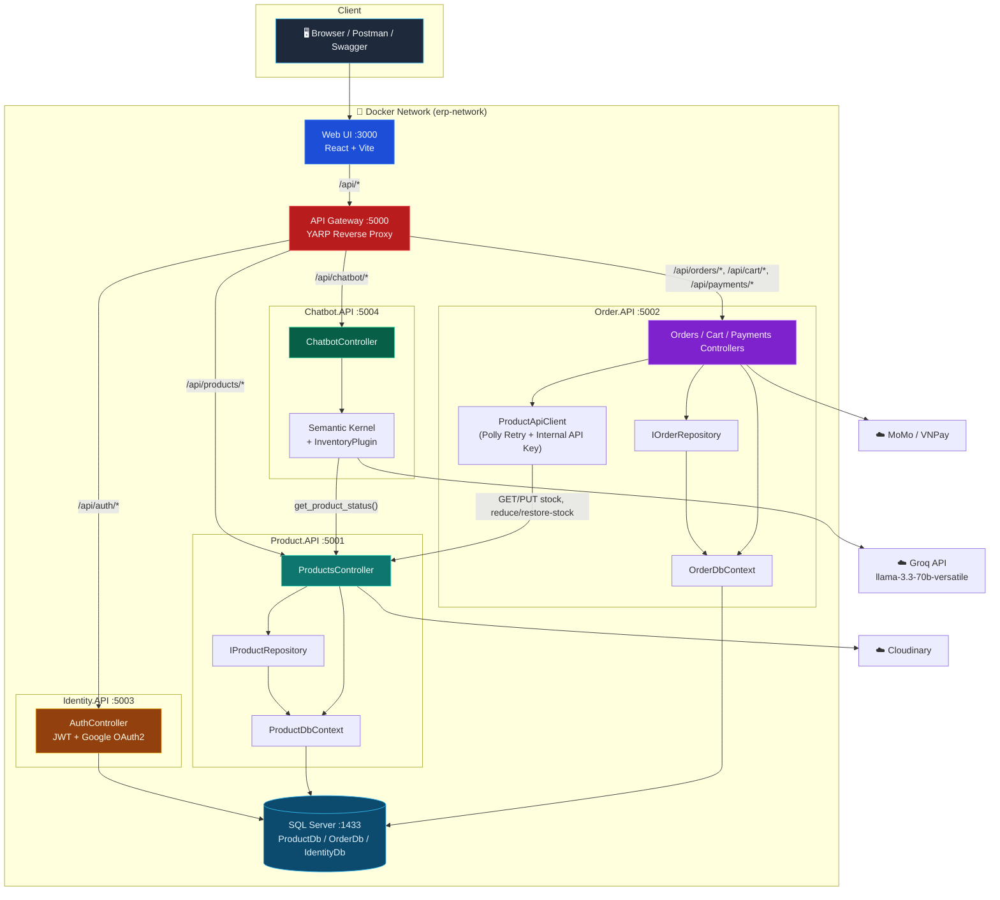

# 🚀 Core ERP Microservices


Hệ thống ERP/E-commerce thu nhỏ được xây dựng theo kiến trúc **Microservices** trên nền **.NET 8**, gồm 5 service backend độc lập, 1 API Gateway (YARP) và 1 Web UI (React 19 + Vite). Dự án minh hoạ các kỹ thuật thường gặp trong hệ thống phân tán thực tế: JWT/OAuth2 Auth, Saga bù trừ (compensating transaction), optimistic concurrency, resilient HTTP client, AI chatbot tư vấn sản phẩm bằng function calling, và CI quality gate cho frontend.

> ⚠️ Đây là project demo/học tập — xem mục [Lưu ý bảo mật](#-lưu-ý-bảo-mật) trước khi public hoặc dùng ở môi trường thật.

---

## ✨ Điểm nổi bật

- ✅ **Kiến trúc Microservices thực sự**: 5 service độc lập — `Identity.API`, `Product.API`, `Order.API`, `Chatbot.API`, `ApiGateway` — mỗi service có DB/Dockerfile riêng, giao tiếp qua HTTP.
- ✅ **Identity.API**: đăng ký/đăng nhập bằng JWT, refresh token có rotation, phân quyền `Admin/Customer`, đăng nhập Google qua OAuth2 Authorization Code Flow.
- ✅ **API Gateway (YARP)**: single entry point, route theo path (`/api/products`, `/api/orders`, `/api/cart`, `/api/payments`, `/api/auth`, `/api/chatbot`).
- ✅ **E-commerce đầy đủ**: giỏ hàng theo user, checkout trực tiếp hoặc từ giỏ hàng, thanh toán `MoMo / VNPay / COD`, callback xác nhận thanh toán, huỷ đơn kèm hoàn kho.
- ✅ **Saga-lite (Compensating Transaction)**: `Order.API` trừ kho tuần tự tại `Product.API`; nếu một sản phẩm thất bại (hết hàng), toàn bộ sản phẩm đã trừ trước đó sẽ được **tự động hoàn kho**.
- ✅ **Optimistic Concurrency an toàn Race Condition**: trừ/hoàn kho bằng raw SQL (`UPDATE ... WHERE StockQuantity >= @qty`) đảm bảo atomic ở tầng database, tránh oversell khi nhiều người mua cùng lúc.
- ✅ **Resilience**: `Order.API` gọi sang `Product.API` qua `IHttpClientFactory` kết hợp **Polly** (retry policy) + API key nội bộ (`X-Internal-ApiKey`) để chống gọi trái phép giữa các service.
- ✅ **AI Product Advisor (Chatbot.API)**: dùng **Microsoft Semantic Kernel** kết nối model qua **Groq** (OpenAI-compatible endpoint, model `llama-3.3-70b-versatile`), có **function calling** (`get_product_status`) để tra cứu tồn kho/giá thật thay vì bịa dữ liệu.
- ✅ **Web UI (React 19 + Vite + TypeScript)**: trang chủ, chi tiết sản phẩm, giỏ hàng, thanh toán, đăng nhập 3D (Spline/Three.js), trang quản trị (Admin Dashboard), chat widget AI — build bằng TailwindCSS 4 + Framer Motion.
- ✅ **Validation & Observability**: `FluentValidation` cho request DTO, **Serilog** structured logging ở mọi service.
- ✅ **Upload ảnh sản phẩm lên Cloudinary** trực tiếp từ `Product.API`.
- ✅ **Unit test**: xUnit + Moq + EF Core InMemory cho `Product.API`/`Order.API`; Vitest + Testing Library cho `WebUI`, có sẵn GitHub Actions quality gate (`lint` + `test:coverage` + `build`) khi thay đổi code frontend.

---

## 🏗 Kiến trúc hệ thống



---

## 🧰 Tech Stack

| Layer | Công nghệ |
|---|---|
| Backend | .NET 8, ASP.NET Core Web API, Entity Framework Core |
| Gateway | YARP (Yet Another Reverse Proxy) |
| Auth | JWT Bearer, Refresh Token rotation, Google OAuth2 |
| AI | Microsoft Semantic Kernel + Groq (OpenAI-compatible API), Function Calling |
| Database | SQL Server 2022 (3 database riêng: `ProductDb`, `OrderDb`, `IdentityDb`) |
| Resilience | Polly (retry policy qua `IHttpClientFactory`) |
| Validation & Logging | FluentValidation, Serilog |
| Media | Cloudinary (upload ảnh sản phẩm) |
| Payment | MoMo, VNPay (sandbox), COD |
| Frontend | React 19, TypeScript, Vite, TailwindCSS 4, Framer Motion, React Three Fiber / Spline (3D login), React Router |
| Testing | xUnit, Moq, FluentAssertions, EF Core InMemory (backend); Vitest, Testing Library (frontend) |
| Container | Docker, Docker Compose |
| CI | GitHub Actions (WebUI quality gate: lint + test coverage + build) |

---

## 📁 Cấu trúc thư mục

```
Core-ERP-Microservices/
├── docker-compose.yml
├── CoreERP.slnx
├── src/
│   ├── ApiGateway/         # YARP reverse proxy (:5000)
│   ├── Identity.API/       # Auth, JWT, Google OAuth2 (:5003)
│   ├── Product.API/        # Catalog, tồn kho, upload ảnh (:5001)
│   ├── Order.API/          # Đơn hàng, giỏ hàng, thanh toán (:5002)
│   ├── Chatbot.API/        # AI Product Advisor (:5004)
│   └── WebUI/              # React + Vite frontend (:3000)
└── tests/
    └── CoreERP.UnitTests/  # xUnit test cho Product.API & Order.API
```

---

## 🚀 Hướng dẫn chạy dự án bằng Docker

Toàn bộ hệ thống (6 service + SQL Server) được container hoá bằng Docker Compose, không cần cài SQL Server hay Node.js thủ công.

### Bước 1 — Yêu cầu hệ thống
- **Docker Desktop** đang chạy.
- **.NET 8 SDK** (chỉ cần nếu muốn build/debug code ngoài Docker).
- **Node.js 20+** (chỉ cần nếu muốn chạy `WebUI` ở chế độ dev thay vì qua Docker).

### Bước 2 — Khai báo biến môi trường cho Chatbot.API
`chatbot-api` cần một API key của Groq (tương thích OpenAI). Tạo file `.env` tại thư mục gốc (cùng cấp `docker-compose.yml`):

```env
OPENAI_API_KEY=your_groq_api_key_here
```

> Không có key này, container `chatbot-api` vẫn khởi động được nhưng mọi request tới `/api/chatbot/ask` sẽ lỗi khi gọi Groq.

### Bước 3 — Build & khởi động toàn bộ hệ thống
Tại thư mục gốc, chạy:

```bash
docker-compose up -d --build
```

**Quá trình này sẽ:**
1. Tải image SQL Server 2022.
2. Build image cho `identity-api`, `product-api`, `order-api`, `chatbot-api`, `api-gateway`, `web-ui`.
3. Khởi động CSDL, tự động chạy **EF Core Migrations** và **seed dữ liệu mẫu** (5 sản phẩm, tài khoản Admin/Customer).
4. Khởi động toàn bộ API và frontend.

> 🛠 **Kiểm tra trạng thái**: chạy `docker ps` — đảm bảo **7 container** đang `Up`: `erp-sqlserver`, `erp-identity-api`, `erp-product-api`, `erp-order-api`, `erp-chatbot-api`, `erp-api-gateway`, `erp-web-ui`.

### Bước 4 — Truy cập ứng dụng

| Thành phần | URL |
|---|---|
| Web UI | http://localhost:3000 |
| API Gateway (entry point chính) | http://localhost:5000 |
| Product.API (Swagger riêng, tuỳ chọn) | http://localhost:5001/swagger |
| Order.API (Swagger riêng, tuỳ chọn) | http://localhost:5002/swagger |
| Identity.API (Swagger riêng, tuỳ chọn) | http://localhost:5003/swagger |
| Chatbot.API (Swagger riêng, tuỳ chọn) | http://localhost:5004/swagger |

### Bước 5 — Xem log (Serilog structured logging)

```bash
docker logs erp-identity-api -f
docker logs erp-product-api -f
docker logs erp-order-api -f
docker logs erp-chatbot-api -f
docker logs erp-api-gateway -f
```
*(Nhấn `Ctrl + C` để thoát.)*

### Bước 6 — Tắt hệ thống

```bash
docker-compose down
```

---

## 🔑 Tài khoản demo nhanh

| Vai trò | Email | Mật khẩu |
|---|---|---|
| Admin | `admin@coreerp.local` | `Admin@123` |
| Customer | `customer@coreerp.local` | `Customer@123` |

Hoặc gọi `GET /api/auth/seed-users` (qua Gateway) để lấy lại thông tin 2 tài khoản này bất kỳ lúc nào.

---

## 🎮 Hướng dẫn demo API (Postman / Swagger)

Toàn bộ request nên đi qua **API Gateway (`:5000`)**. Các cổng `5001–5004` chỉ mở thêm để tiện xem Swagger UI độc lập của từng service.

### 1. Đăng nhập lấy JWT
```http
POST http://localhost:5000/api/auth/login
Content-Type: application/json

{ "email": "customer@coreerp.local", "password": "Customer@123" }
```
Lấy `accessToken` trong response, đính vào header `Authorization: Bearer {token}` cho các request cần xác thực bên dưới.

### 2. Xem danh sách sản phẩm
```http
GET http://localhost:5000/api/products
```
> Kết quả: danh sách sản phẩm được seed sẵn.

### 3. Kiểm tra tồn kho trước khi đặt hàng
```http
GET http://localhost:5000/api/products/1/stock
```

### 4. Tạo đơn hàng trực tiếp (Order.API → gọi ngầm Product.API)
```http
POST http://localhost:5000/api/orders
Authorization: Bearer {token}
Content-Type: application/json

{
  "paymentMethod": "COD",
  "items": [
    { "productId": 1, "quantity": 2 },
    { "productId": 2, "quantity": 1 }
  ]
}
```
**Chuyện gì xảy ra phía dưới?**
- Request qua Gateway → route sang `Order.API`.
- `Order.API` kiểm tra sản phẩm/tồn kho từng item qua `Product.API` (`ProductApiClient` + Polly retry).
- Trừ kho tuần tự bằng optimistic concurrency (raw SQL) tại `Product.API`.
- Nếu tất cả thành công → insert đơn hàng, trả `201 Created`. Với `MOMO`/`VNPAY` sẽ trả kèm `paymentUrl`; với `COD` đơn được xác nhận (`Confirmed`) ngay.

### 5. Thêm sản phẩm vào giỏ & checkout từ giỏ
```http
POST http://localhost:5000/api/cart/items
Authorization: Bearer {token}
Content-Type: application/json

{ "productId": 1, "quantity": 2 }
```
```http
POST http://localhost:5000/api/orders/checkout-from-cart
Authorization: Bearer {token}
Content-Type: application/json

{ "paymentMethod": "COD" }
```

### 6. Demo Validation (FluentValidation)
Cố tình đặt số lượng âm để test:
```json
{ "paymentMethod": "COD", "items": [ { "productId": 1, "quantity": -5 } ] }
```
> Kết quả: `400 Bad Request` dạng Problem Details, không làm crash backend.

### 7. Demo Compensating Transaction (hoàn kho) khi hết hàng
Giả sử `Product 2` chỉ còn tồn kho thấp, đặt số lượng vượt quá tồn kho thực tế cho item thứ 2 trong khi item đầu hợp lệ:
```json
{
  "paymentMethod": "COD",
  "items": [
    { "productId": 1, "quantity": 1 },
    { "productId": 2, "quantity": 500 }
  ]
}
```
> Kết quả: Product 1 trừ kho thành công, Product 2 báo lỗi hết hàng → hệ thống **tự động gọi API hoàn kho** cho Product 1, đơn hàng không được tạo, dữ liệu tồn kho vẫn chính xác 100%.

### 8. Hỏi AI Product Advisor
```http
POST http://localhost:5000/api/chatbot/ask
Content-Type: application/json

{ "userMessage": "So sánh giúp tôi iPhone 15 Pro Max và Samsung Galaxy S24" }
```
> AI sẽ tự động gọi function `get_product_status` để lấy giá/tồn kho thật từ `Product.API` trước khi tư vấn, không tự bịa số liệu.

---

## ⚙️ Biến môi trường cần cấu hình cho production thật

| Service | Biến | Ý nghĩa |
|---|---|---|
| `Identity.API` | `OAuth2__Google__ClientId`, `OAuth2__Google__ClientSecret`, `OAuth2__Google__RedirectUri` | Đăng nhập Google |
| `Order.API` | `Payment__VNPay__TmnCode`, `Payment__VNPay__HashSecret`, `Payment__MoMo__PartnerCode`, `Payment__MoMo__AccessKey`, `Payment__MoMo__SecretKey` | Cổng thanh toán thật |
| `Product.API` | `Cloudinary__CloudName`, `Cloudinary__ApiKey`, `Cloudinary__ApiSecret` | Upload ảnh sản phẩm |
| `Chatbot.API` | `OpenAI__ApiKey` (đọc từ `OPENAI_API_KEY`) | Key gọi model qua Groq |
| Tất cả service | `Jwt__Secret`, `Jwt__Issuer`, `Jwt__Audience` | Ký/xác thực JWT — **phải giống nhau** giữa các service |
| `Product.API` / `Order.API` | `Security__InternalApiKey` | API key nội bộ giữa Order ↔ Product, chặn gọi từ bên ngoài |

---

## 🔒 Lưu ý bảo mật

`docker-compose.yml` hiện đang **hard-code trực tiếp** một số secret thật (JWT signing key, Cloudinary API secret, Google OAuth Client Secret, mật khẩu SQL `sa`). Điều này tiện cho demo nhanh nhưng **không an toàn nếu repo là public**:

- Nên chuyển các giá trị này ra file `.env` (đã có sẵn trong `.gitignore`) hoặc dùng `dotnet user-secrets` / Docker secrets khi phát triển thật.
- Nếu các key trong `docker-compose.yml` đã từng được commit lên GitHub public, hãy **rotate (tạo lại) toàn bộ key đó** ngay (Cloudinary API secret, Google OAuth Client secret, JWT secret) vì chúng coi như đã bị lộ.
- Mật khẩu SQL Server (`SA_PASSWORD`) trong file demo chỉ nên dùng cho môi trường local/dev.

---

## 🧪 Testing

**Backend** (xUnit + Moq + FluentAssertions + EF Core InMemory):
```bash
dotnet test
```

**Frontend** (`src/WebUI`, Vitest + Testing Library):
```bash
cd src/WebUI
npm install
npm run lint            # ESLint
npm run test:coverage   # Vitest + coverage
npm run build           # tsc + vite build
# hoặc chạy cả 3 bước cùng lúc:
npm run quality:check
```
CI (`.github/workflows/webui-quality.yml`) tự động chạy `quality:check` mỗi khi có thay đổi trong `src/WebUI/**`.

---

## 📌 Roadmap gợi ý

- [ ] Thêm health-check endpoint (`/health`) cho từng service + hiển thị trên Gateway.
- [ ] Đưa secret ra ngoài `docker-compose.yml` (Docker secrets / Key Vault).
- [ ] Circuit breaker (Polly) bên cạnh retry policy hiện có.
- [ ] Event-driven giữa Order ↔ Product (message broker) thay vì gọi HTTP đồng bộ.
- [ ] Viết thêm test cho `Identity.API` và `Chatbot.API`.

---

## 📄 License

Dự án cá nhân phục vụ mục đích học tập/portfolio. Có thể tham khảo và tái sử dụng, vui lòng ghi nguồn nếu fork lại.
